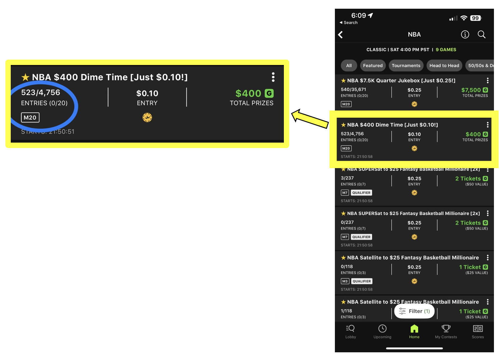
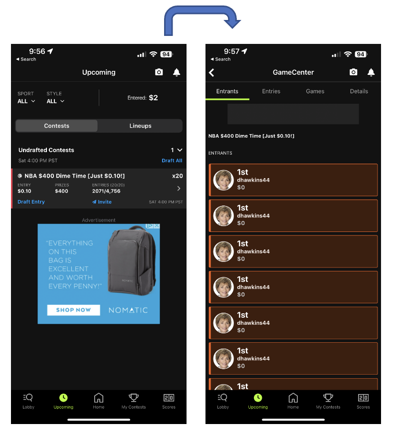
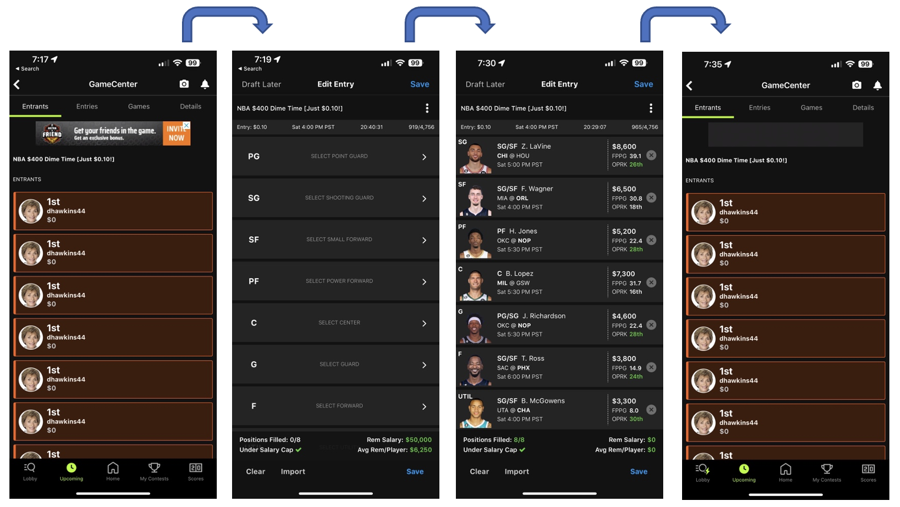
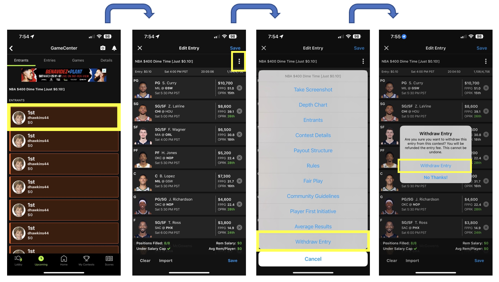

# Daily Fantasy Sports at Scale: A DraftKings Experience

---

Like so many other NFL football fans during the months of September through February, I love to participate in fantasy football. In fantasy sports, participants create a virtual team of real-life athletes and compete against other teams in a league or contest based on the statistical performance of those players in actual professional sports games. There are two ways that fantasy sports are typically played: traditional and daily. Daily fantasy differs from traditional fantasy in that it typically lasts only one day to one week, rather than the entire season. For the purposes of this user experience journal, I will focus on daily fantasy and the use of the DraftKings iPhone mobile application to play. I mostly play fantasy during the NFL season. However, since the NFL season is over for the year, I am going to enter into an NBA contest to demonstrate the experience.

My goal is to enter 20 entries into a contest called “NBA $400 Dime Time” and draft a unique team of players for each of those entries. I have included a screenshot below where I have circled the entry details in blue to show you some relevant information to this demonstration:

-	523/4,756 shows that there are a total of 4,756 entries allowed in this contest and 523 of them have been reserved.
-	ENTRIES (0/20) shows that I am allowed 20 entries in this contest, and I have not yet entered any lineups or reserved spots.
-	M20 in the box is saying that there is a maximum of 20 entries allowed in the contest. 

DraftKings allows you to “Reserve Seats” in advance without having drafted the teams for those entries. This guarantees you get those spots, but you must have your team drafted before the start of the first game of the contest. After I have reserved the spots, I can click on the contest and see all my reserved spots.

Now that I have reserved the spots, I would like to draft my teams for the entries. I click on one of the red instances and I get the below screen to draft my team. You can see the drafted team on the rightmost image. When I am done with drafting the team, I press “Save” in the top, right-hand corner and it takes me back to the screen with all my entries. Notice in the flowchart below, that when I am taken back to my list of entries after drafting my team, there is no indication that I have drafted the team for that entry. How am I supposed to know which entries I have already drafted? This gets especially difficult when you have drafted 10 or so entries. You end up having to scroll and open every entry until you’ve reached one that has not been drafted. This takes away any **efficiency** of entering in multiple lineups for the same contest because it takes so long to figure out which entry has been drafted or not. This could easily be solved with some kind of indicator like a checkmark, or color change to show that the entries have been drafted.

What if I accidentally enter the maximum allowed entries for a contest I did not mean to? I demonstrate how this would go in [this video](https://user-images.githubusercontent.com/4731855/224468789-c7ef5b45-4eaa-40c8-b42b-76ac67d90d98.MOV). DraftKings does allow you to withdraw from a contest (that has not yet been filled), but there is no way to withdraw multiple entries at once. You must click through on each entry, demonstrated in the flowchart below. That’s four clicks for each entry! Some contests have a maximum of up to 150 entries! The lack of **error tolerance** exposed with this flaw is a big one. An error of a user should be easily corrected by that user. They should not be put in a situation where they financially suffer because of a design flaw where the resolution to an error takes so long. This could easily be solved with a way to “select” multiple entries at once and withdraw them all in one fell swoop.

I have one last scenario I would like to go over. Let’s assume that there is a player that has a great matchup against another team, and I want to play them in all my lineups. What happens if that player ends up not playing for some reason (injury, illness, personal reasons, etc.)? What if that decision is made 15 minutes before the game starts? You can see an example of this below; Kevin Durant is in all my lineups, but he is marked out. I will need to switch that player out of my lineup for another player. That should be easy, right? Wrong! You must click into each lineup and manually change the player out for another. This puts the safety of DraftKings’ users at risk to lose money on a contest with entries they did not have a chance to correct due to a design flaw. This could easily be fixed by providing an option to substitute a player from all or some of your lineups using multiple selection.

